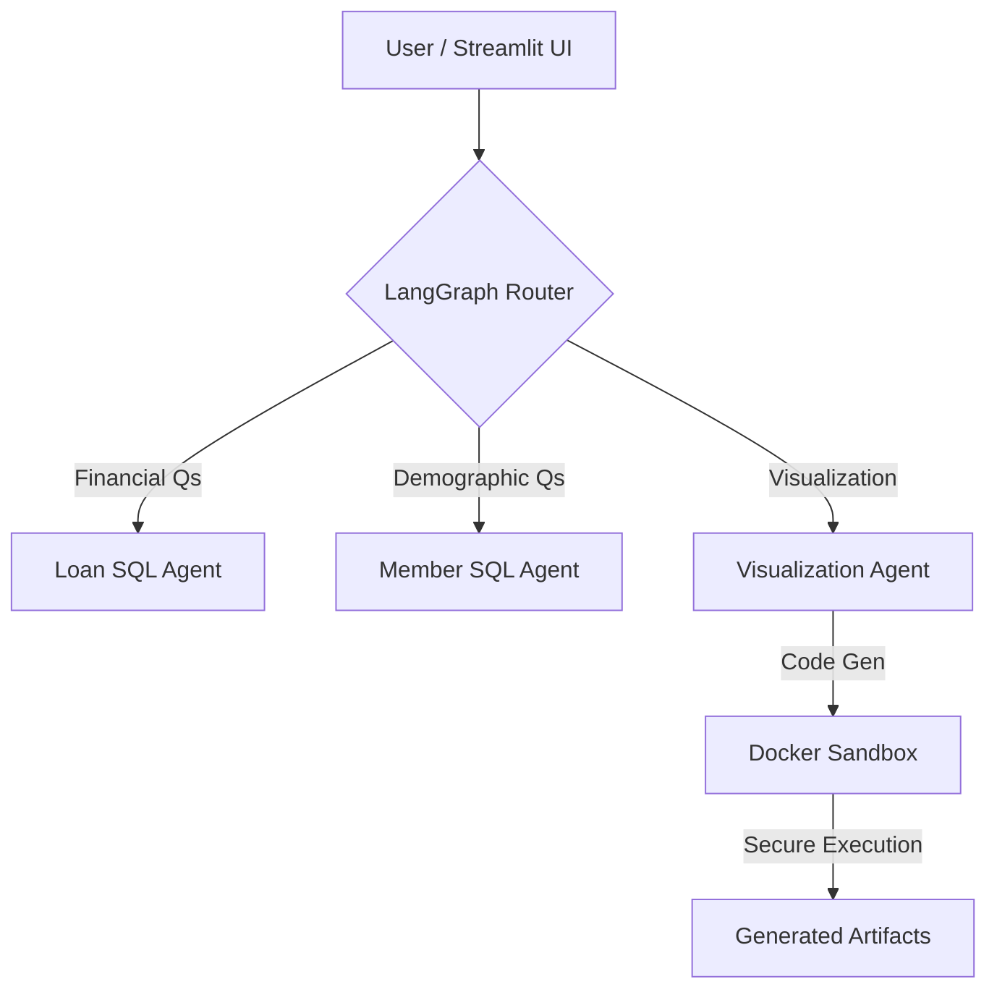

# 🏦 Self-Serve Credit Union Analyst Platform

> **A secure, multi-agent GenAI platform allowing non-technical stakeholders to query financial data and generate visualizations using natural language.**

---

## 🚀 Business Value & Problem Solved
Financial analysts often spend 40-60% of their time answering ad-hoc SQL queries for non-technical departments ("How many loans do we have in Washington?").

This platform acts as an **Autonomous Data Analyst**, enabling self-service for executives and managers while enforcing strict data governance. It reduces query turnaround time from **hours to seconds**.

## 🏗 System Architecture
This is not a simple wrapper around ChatGPT. It is a **Federated Multi-Agent System** engineered for enterprise security.

Key Technical Features
Multi-Agent Orchestration (LangGraph): A semantic router directs queries to specialized sub-agents (Member Data vs. Loan Data), preventing context pollution and improving accuracy.

RCE Mitigation (Docker Sandbox): The AI generates Python code for visualization, but execution is isolated within a disposable Docker container. This prevents the LLM from accessing the host file system or environment variables.

Database Agnostic: Configured via .env to switch seamlessly between local SQLite (for dev) and PostgreSQL/Oracle (for prod) without code changes.

Federated Data Handling: Capable of querying disparate databases and merging the results in-memory for cross-domain analysis.

🛡️ Security & Governance
This project implements a Defense-in-Depth strategy suitable for FinTech environments:

Principle of Least Privilege: Agents connect via Read-Only service accounts.

Network Isolation: The code execution sandbox has no internet access, preventing data exfiltration.

Input Guardrails: Semantic routing filters out irrelevant or malicious prompts before they reach the database tools.

🛠️ Quick Start (Local Development)
Prerequisites: Docker Desktop, Python 3.10+

Clone the Repository

Bash

git clone [https://github.com/Robby-Burns/SelfServeAnalyst.git](https://github.com/Robby-Burns/SelfServeAnalyst.git)
cd SelfServeAnalyst
Configure Environment

Bash

cp .env.example .env
# Add your OpenAI API Key to .env
Build & Launch

Bash

# 1. Setup the dummy database
python setup_db.py

# 2. Build the secure sandbox container
docker build -t tool-sandbox .

# 3. Start the application
streamlit run app.py
🧪 Testing Strategy
Includes a comprehensive integration test suite verifying the "Plumbing" of the architecture:

Bash

pytest tests/test_system.py -v
✅ Database Connectivity: Verifies schema integrity.

✅ Container Health: Checks if the Docker sandbox is responsive.

✅ File Permissions: Ensures agents can write charts to the volume mount.

🔮 Future Production Roadmap
Infrastructure: Migration from local Docker to AWS Fargate for ephemeral sandboxing.

Observability: Integration with LangSmith for tracing agent reasoning chains and token costs.

Human-in-the-Loop: Admin review interface for flagging incorrect SQL generations.

Built by Robby Burns - Product Manager & AI Engineer